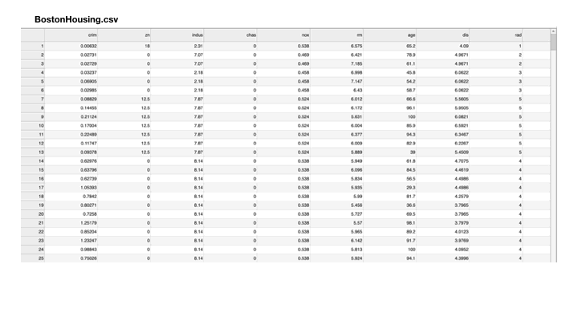

#Sprint 3
During sprint 3 each team will implement the assigned features.  To more easily communicate expectations for each
of the features, animated mock-ups have been created (see below)

Each feature should be developed using react and the actual implementation may differ from the mock-up if students 
desire, so long as the intended functionality is preserved. 

## Search and Replace
User enters a search term, a replacement, and clicks a button to replace all matches.  

## Edit and Save
User clicks on a cell and enters replacement text.  After the user presses enter, the updated information should be
saved to the file.  If the cell loses focus without pressing enter, changes should be discarded.

## Sort
User clicks an arrow at the top of each column to sort that column.  As a bonus, each click will result in either
ascending or descending sort order.  

## Hide
Right-clicking a column header will present the user with an option to hide the column.

## Filter
Right clicking a cell in any column will cause only rows matching that column to be displayed.

